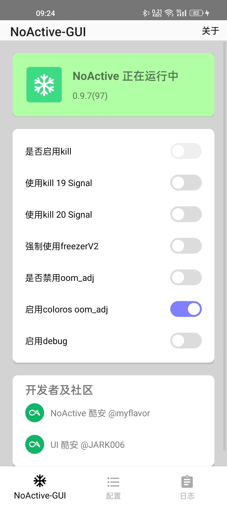
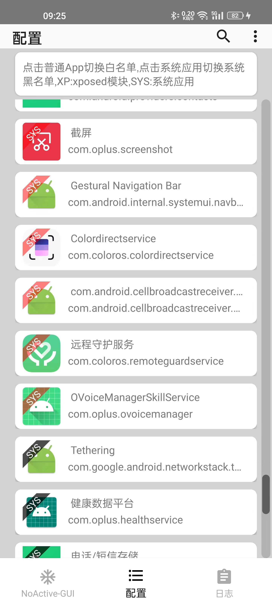

# NoActiveGui

这是xposed 模块 [NoActive](https://github.com/myflavor/NoActive) 的 UI配置app, ui 来自 [freezeitapp](https://github.com/jark006/freezeitapp)

## 下载
  [Release](https://github.com/Teddy-Zhu/NoActiveGui/releases)

## 功能

1. 图形化配置 whiteApp blackSystemApp
2. 功能配置, debug, 开关oom ,coloros oom, 强制freezerV2, kill 19 ,20

## TODO

 - [x] 配置 kill 19/20
 - [x] 配置 coloros lmk , oom hook switch
 - [x] 开关debug
 - [ ] 优化修改配置方案，目前 `su cmd` 方式不够优雅
 - [x] 检测NoActive 是否安装启用
 - [x] NoActive log 显示 
## screenshots

 
 
 

PS: 业余android coder 水平有限， 欢迎pr